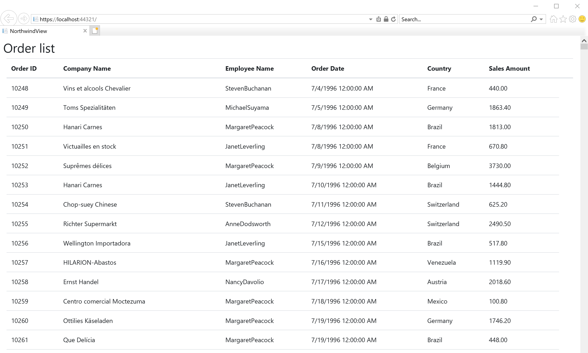
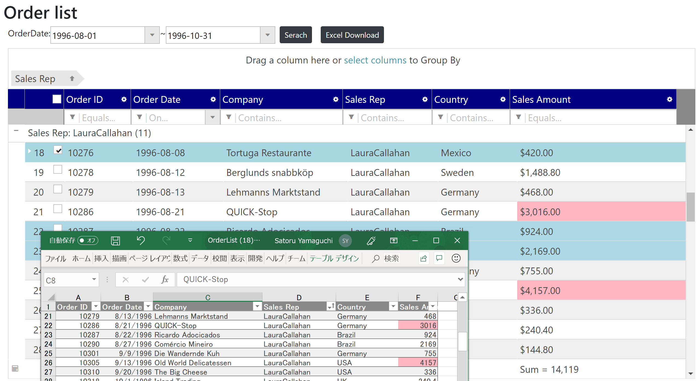

# igniteui-.net-core-workshop

## About this workshop

This workshop is for those who want to try Infragistics product in .NET Core/Api/MVC application or who are looking for rich and modern Web UI controls, e.g. grid and chart, that can be used for web application development. 

You can experience how to build rich web app with Ignite UI and see its productivity through this workshop.

## Check your environment

Before starting this hands-on workshop please check your environment to see if it's ready.

[Required Environment](docs/00-Environment.md)

## Preparing the application for the workshop

Download the copy of this repository and find infragistics-.net-core-workshop/src/before/NorthwindView project which would be the start point of this workshop.

This application simply displays order information from Northwind Database, which is a well-known sample database provided by Microsoft. 

This project includes Northwind.mdf and all Models required in the workshop. You can get order data via Entity Framework with those models in this project.

## What you build in the workshop

In this workshop, you migrate a web application from old fashion UI to rich & modern UI with Ignite UI for Javascript.

Before:

The application simply displays Sales(Order) data which comes from the Northwind sample DB  via Entity framework

After:

After the migration with Ignite UI, the grid UI has many features like sorting, filtering, grouping, summarizing, column moving and hiding which help end-users to be more productive. Also, it has a capability to export data as an Excel file.

## Note

In src/02-After folder, you can check the project completing all instructions in this workshop.

## All steps

1. [Section 1 - Understand NorthwindView project](docs/01-Understand-the-current-project/01-00-Understand-NorthwindView-Project.md)
2. [Section 2 - Create API returning JSON data](docs/02-Create-API-Returning-JSON/02-00-Overview-of-Section2.md)
    1. [Search conditions on the view.md](docs/02-Create-API-Returning-JSON/02-01-Search-conditions-on-the-view.md)
    2. [Create API](docs/02-Create-API-Returning-JSON/02-02-Create-API.md)
    3. [Get data from API](docs/02-Create-API-Returning-JSON/02-03-Get-data-from-API.md)
3. [Section 3 - Display data on Grid](docs/03-Display-data-on-Grid/03-00-Overview-of-Section3.md)
    1. [Get started with IgniteUI](docs/03-Display-data-on-Grid/03-01-Get-started-with-IgniteUI.md)
    2. [Use DatePicker](docs/03-Display-data-on-Grid/03-02-Use-DatePicker.md)
    3. [Use Grid](docs/03-Display-data-on-Grid/03-03-Use-Grid.md)
    4. [Set Grid options](docs/03-Display-data-on-Grid/03-04-Set-Grid-options.md)
4. [Section 4 - Configure Grid](docs/04-Configure-Grid/04-00-Overview-of-Section4.md)
    1. [Enable Grid Features](docs/04-Configure-Grid/04-01-Enable-Grid-Features.md)
    2. [Set Feature Options](docs/04-Configure-Grid/04-02-Set-Feature-Options.md)
5. [Section 5 - Style Grid](docs/05-Style-Grid/05-00-Overview-of-Section5.md)
    1. [Override-default-theme](docs/05-Style-Grid/05-01-Override-default-theme.md)
    2. [Conditional Styling](docs/05-Style-Grid/05-02-Conditional-Styling.md)
6. [Section 6 - Export Excel](docs/06-Export-Excel/06-00-Overview-of-Section6.md)
    1. [Add Resources](docs/06-Export-Excel/06-01-Add-Resources.md)
    2. [Export as Excel](docs/06-Export-Excel/06-02-Export-As-Excel.md)
    3. [Change Excel format](docs/06-Export-Excel/06-03-Change-Excel-Format.md)