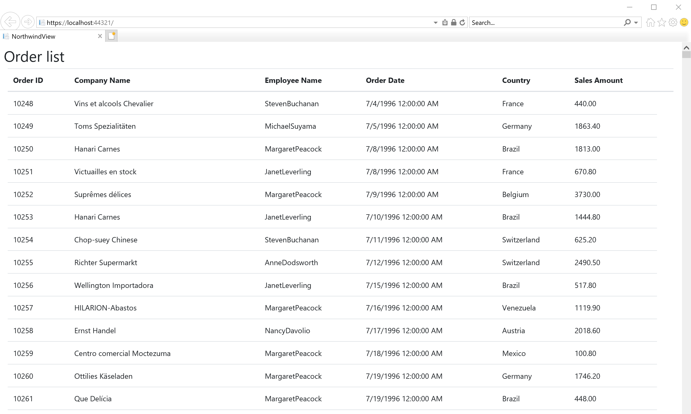
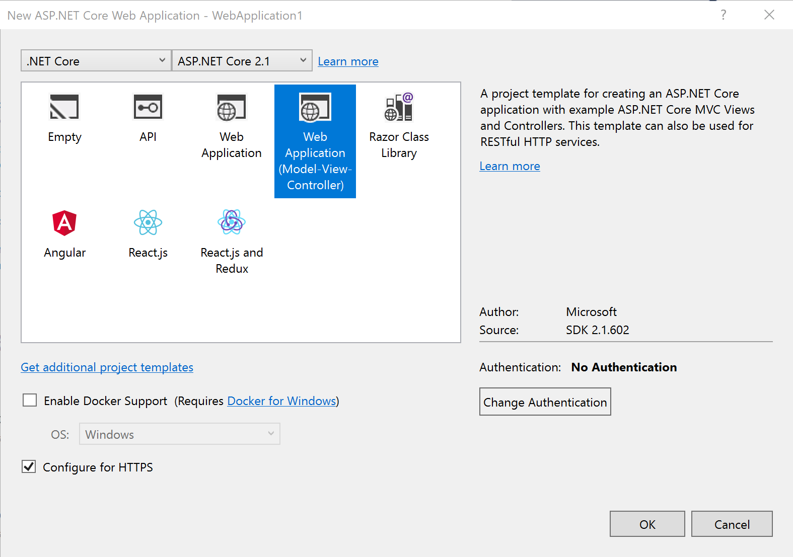

# Understanding the current project before the migration

Before writing code, let's check what's in the project to be migrated with Ignite UI for Javascript.


## Download the project

Download the copy of this repository and find infragistics-.net-core-workshop/src/before/NorthwindView project which would be the start point of this workshop.

Open the solution named "NorthwindView.sln" in "before" folder you downloaded, which is in igniteui-.net-core-workshop/src/before.

## Run the project

Let's run the project and see the result.



The application simply displays the order information from Northwind Database. 

The table view styled by Bootstrap looks nice, but you can't do sorting, filtering, grouping and summarizing on this table view.

## See what's in the project

This project is based on the template project created by visual studio. You can see similar directory structure in the project if you create a new "ASP.NET Core Web Application" project with "Web Application (Model-View-Controller)" template.



In this project, we have
- Models
    - Models\\xxx.cs: Models to get data from Northwind.mdf
- Views
    - Views\\Home\\Index.cshtml: Main view for this application to display order information
    - Views\\Shared\\_Layout.cshtml: Layout view including CDN references linking to Bootstrap, jQuery and etc.
- Controllers
    - Controllers\\HomeController.cs: 
- App_Data
    - Northwind.MDF: Sample DB for order information
    - NorthWind Relation.png: You can check the relations of tables in Northwind

Let's take a look closer at Controller and View.

*Controllers\\HomeController.cs*

```cs
...
public IActionResult Index()
{
    var queryOrderInfo =
        (from o in _northwindContext.Orders
            join ods in _northwindContext.OrderDetails
                .GroupBy(o => o.OrderId)
                .Select(o => new { orderID = o.Key, salesAmount = o.Sum(x => x.Quantity * x.UnitPrice) })
            on o.OrderId equals ods.orderID
            select new OrderInfo
            {
                OrderId = o.OrderId,
                CompanyName = o.Customer.CompanyName,
                EmployeeName = o.Employee.FirstName + "" + o.Employee.LastName,
                OrderDate = o.OrderDate,
                ShipCountry = o.ShipCountry,
                SalesAmount = ods.salesAmount,
            });
    return View(queryOrderInfo.ToList());
}
...
    
```

```html
@model IEnumerable<NorthwindView.Models.OrderInfo>

<h2>Order list</h2>

<div class="mx-2">
    <div id="grid">
        <table class="table">
            <thead>
                <tr>
                    <th>
                        Order ID
                    </th>
                    <th>
                        Company Name
                    </th>
                    <th>
                        Employee Name
                    </th>
                    <th>
                        Order Date
                    </th>
                    <th>
                        Country
                    </th>
                    <th>
                        Sales Amount
                    </th>
                    <th></th>
                </tr>
            </thead>
            <tbody>
                @foreach (var item in Model)
                {
                    <tr>
                        <td>
                            @Html.DisplayFor(modelItem => item.OrderId)
                        </td>
                        <td>
                            @Html.DisplayFor(modelItem => item.CompanyName)
                        </td>
                        <td>
                            @Html.DisplayFor(modelItem => item.EmployeeName)
                        </td>
                        <td>
                            @Html.DisplayFor(modelItem => item.OrderDate)
                        </td>
                        <td>
                            @Html.DisplayFor(modelItem => item.ShipCountry)
                        </td>
                        <td>
                            @Html.DisplayFor(modelItem => item.SalesAmount)
                        </td>
                    </tr>
                }
            </tbody>
        </table>
    </div>
</div>
```

1. In the Controller, it simply gets data from Northwind via Entity Framework with LINQ query syntax and return it to the View.
2. In the View, it recieves order data via Model and then loops the data to generate table/tr/td DOM with 

This is a typical way of making UI on MVC type application. But the view has so many DOM created on server side and it's too heavy for the communication between client and server, which impacts the application performance and memory usage.

Okay, let's make this app more rich and high performance from the next section.

## Next
[01-02 Overview of Section2](../02-Create-API-returning-JSON/02-00-Overview-of-Section2.md)
