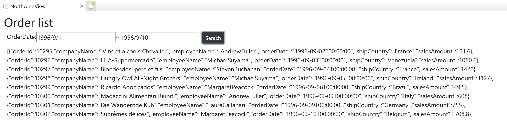

# Create API returning JSON

In this section, you create an API returning JSON data filtered by search conditions.

## Steps
1. [Search conditions on the view.md](02-01-Search-Conditions-On-The-View.md)
2. [Create API](02-02-Create-API.md)
3. [Get data from API](02-03-Get-Data-From-API.md)

## Next
[02-01 Search conditions on the view](02-01-Search-Conditions-On-The-View.md)