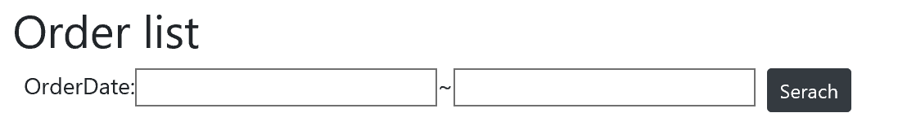

# Search conditions on the View

You prepare some elements as search conditions on the view so end users can search order data between those 2 order date.



## Put input elements and search button

Open Views\\Home\\Index.cshtml. Remove all table/tr/td tags and then put input elements and search button as below.

```html
<h2>Order list</h2>
<div class="mx-2">
    <div class="d-flex align-items-start mb-2">
        OrderDate:
        <input id="orderDateFrom" type="date" />
        ~
        <input id="orderDateTo" type="date" />
        <button id="btnSearch" class="btn btn-dark btn-sm mx-2">Serach</button>
    </div>

    <div id="grid"></div>
</div>    
```

## Next
[02-02 Create API](02-02-Create-API.md)
