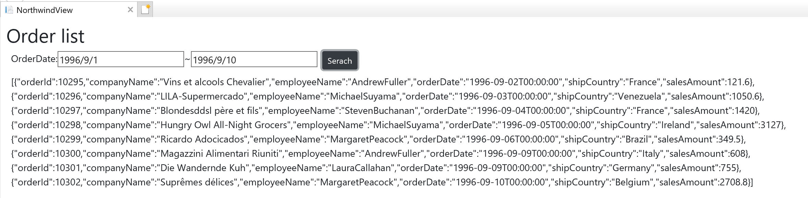

# Get data from API

Request Order data with parameters and check JSON result.

## Request Order data

Open Views\\Home\\Index.cshtml. Add Script section at the bottom of the view and write some code for the ajax request triggered by Search button click as below. 

Views\\Home\\Index.cshtml

```cs
...
    <div id="grid"></div>
</div>

<script>
    $(function () {
        $('#btnSearch').click(function (e) {
            $.ajax({
                url: 'Home/GetOrders',
                type: 'GET',
                dataType: 'json',
                data: {
                    pOrderDateFrom: $('#orderDateFrom').val(),
                    pOrderDateTo: $('#orderDateTo').val()
                }
            }).done(function (data) {
                $('#grid').text(JSON.stringify(data));
                if (data.length == 0) alert('No data');
            }).fail(function (jqXHR, textStatus, errorThrown) {
                alert('failed');
            });
        });
    });
</script>
```

In $.ajax({...}) part, it is to access the the GetOrders() API with 2 parameters, orderDateFrom and orderDateTo. Once the data came to the client, the stringfied JSON data is set into <div id=grid></div> in the call back function .done(function...).


## Check the result

Run the app to check the result. If everything is working fine, you can search order information by order dates and see the result with JSON data as below.



## Next
[02-04 Configure BulletGraph](02-04-Configure-BulletGraph.md)
