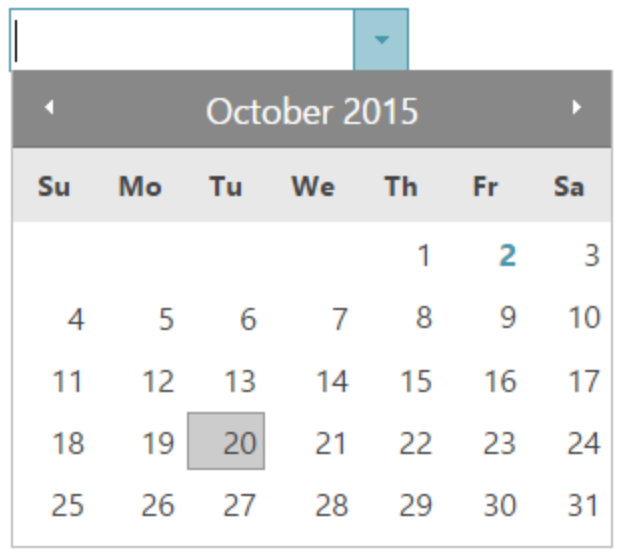

#  Section 3

In this section, you use Ignite UI for Javascript controls to make the UI rich and robust. 

## Steps
1. [Get started with IgniteUI](03-01-Get-started-with-IgniteUI.md)
2. [Use DatePicker](03-02-Use-DatePicker.md)
3. [Use Grid](03-03-Use-Grid.md)
4. [Set Grid options](03-04-Set-Grid-options.md)

## What you build in this section

## Next
[03-01 Get started with IgniteUI](03-01-Get-started-with-IgniteUI.md)