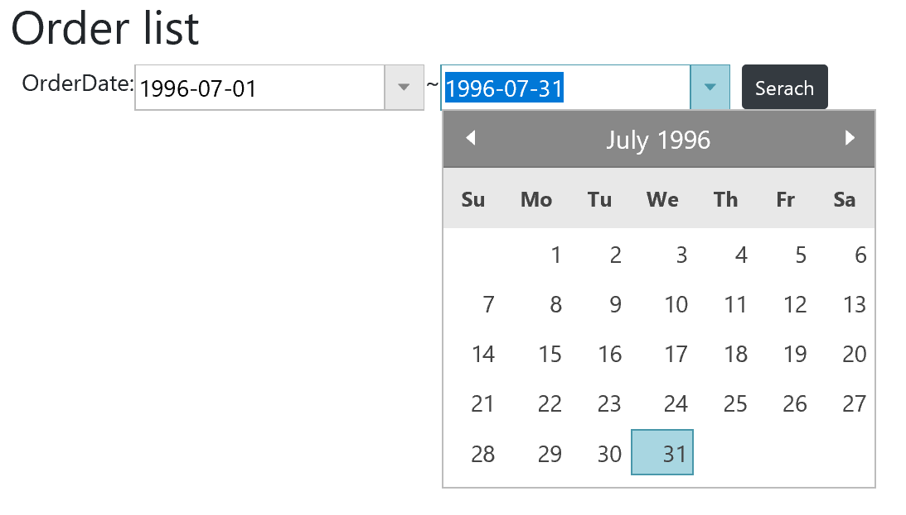

# Use DataGrid

Use igDatePicker control to make search conditions more easy to input.


## How to get igDatePicker up and running
Open Views\\Home\\Index.cshtml. You already have input elements for order dates as search conditions, so what you have to do next is initialize igDatePicker specifying order date inputs by id. 

Views\\Home\\Index.cshtml

```js
...
<script>
    $(function () {
        // ↓↓↓ Added ↓↓↓
        $("#orderDateFrom").igDatePicker({ dateInputFormat: "yyyy-MM-dd" });
        $("#orderDateTo").igDatePicker({ dateInputFormat: "yyyy-MM-dd" });
        // ↑↑↑ Added ↑↑↑
...
```

## Check the result

Run the app and check the result.



## Note
If you want to know more about igDatePicker check the following help topic.

[igDatePicker Overview](https://www.igniteui.com/help/igdatepicker-overview)

[Sample for igDatePicker](https://www.igniteui.com/editors/date-picker-overview)

[API Reference for igDatePicker](https://www.igniteui.com/help/api/2019.1/ui.igdatepicker)

## Next
[Use Grid](03-03-Use-Grid.md)