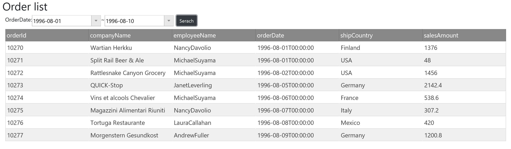

# Use Grid

Use igGrid control to display order information on a grid UI.



## How to get igGrid up and running
Open Views\\Home\\Index.cshtml. You already have a div tag to display stringified JSON data inside, so what you have to do next is initialize igGrid specifying the div element by id in the call back function as below.

Views\\Home\\Index.cshtml

```js
...
            }).done(function (data) {
                // ↓↓↓ Modified ↓↓↓
                //$('#grid').text(JSON.stringify(data));
                $('#grid').igGrid({ dataSource: data });
                // ↑↑↑ Modified ↑↑↑
...
```

## Check the result

Run the app and check the result.


## Note
If you want to know more about igGrid check the following help topic.

[igGrid Overview](https://www.igniteui.com/help/iggrid-overview)

[igGrid/igDataSource Architecture Overview](https://www.igniteui.com/help/iggrid-igdatasource-architecture-overview)

[Sample for igGrid](https://jp.igniteui.com/grid/overview)

[API Reference for igGrid](https://www.igniteui.com/help/api/2019.1/ui.igdatepicker)
