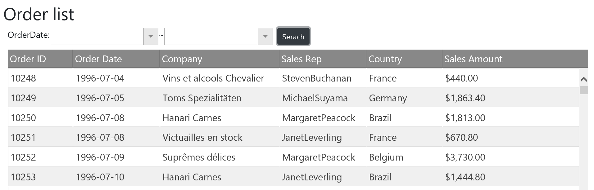

# Set grid options

Now the grid UI is show up when searching order data is completed. But it's more natural to have a grid UI with defined columns at the beginning, and show order data when searching is completed.

## Define columns 
Open Views\\Home\\Index.cshtml. Initialize igGrid with some option settings and column definitions as below.

Views\\Home\\Index.cshtml

```js
...
            }).fail(function (jqXHR, textStatus, errorThrown) {
                alert('failed');
            });
        });     
        // ↓↓↓ Added ↓↓↓
        $("#grid").igGrid({
            autoGenerateColumns: false,
            width: "100%",
            height: "600px",
            primaryKey: "orderId",
            dataSource: [],
            rowVirtualization: true,
            virtualizationMode: "continuous",
            columns: [
                { headerText: "Order ID", key: "orderId", dataType: "number", width: "120px" },
                { headerText: "Order Date", key: "orderDate", dataType: "date", width: "160px", format: "yyyy-MM-dd" },
                { headerText: "Company", key: "companyName", dataType: "string", width: "220px" },
                { headerText: "Sales Rep", key: "employeeName", dataType: "string", width: "160px" },
                { headerText: "Country", key: "shipCountry", dataType: "string", width: "140px" },
                { headerText: "Sales Amount", key: "salesAmount", dataType: "number", width: "150px", format: "currency" },
            ],
        });
        // ↑↑↑ Added ↑↑↑
    });
</script>
```

Additonal comments for grid options.
- autoGenerateColumns: When this option is set true, the grid automatically generate columns definitions based on the bound data source.
- dataSource: In this case, you just set empty collection [] because you want to bind data after the searching is completed.
- rowVirtualization & virtualizationMode: These options for virtualizing rows/cells ourside the viewport, to dramatically improve the rendering performance.

## Check the result

Run the app and check the result.



## Note
If you want to know more about igGrid options check the following help topic.

[API Reference for igGrid options](https://www.igniteui.com/help/api/2019.1/ui.igdatepicker#options)

## Next
[04-00 Overview of Section4](../04-Configure-Grid/04-00-Overview-of-Section4.md)