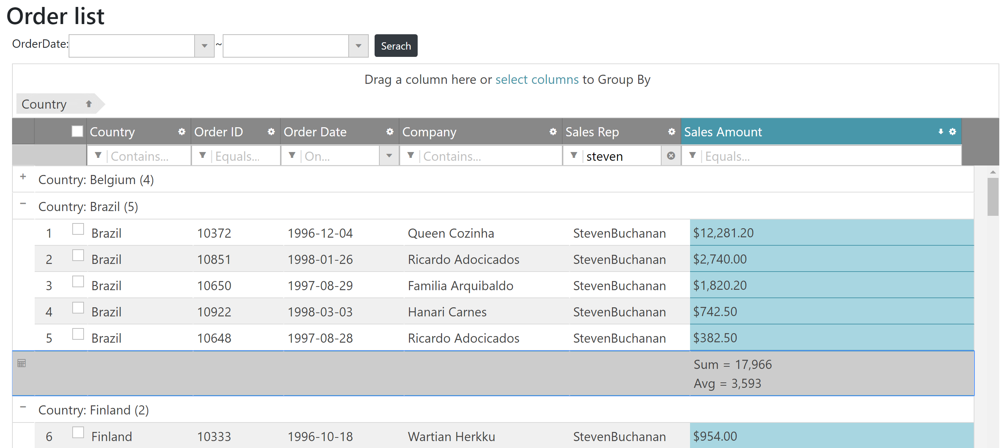

# Enable Grid feature options

Each grid feature has own many options to adapt to a variety of use cases.

## Change filtering UI

Change filtering UI from dialog based UI to simple one.

Views\\Home\\Index.cshtml

```js
...
{
    name: "Filtering",
    // ↓↓↓ Added ↓↓↓
    mode: "simple"
    // ↑↑↑ Added ↑↑↑
},
...
```

## Enable multiple rows selection with checkbox

The default selection feature is based on cell selection. Change it to multiple rows selection and display row's number on the row selector area.

Views\\Home\\Index.cshtml

```js
...
{
    name: "Selection",
    // ↓↓↓ Added ↓↓↓
    mode: 'row',
    multipleSelection: true
    // ↑↑↑ Added ↑↑↑
},
{
    name: "RowSelectors",
    // ↓↓↓ Added ↓↓↓
    enableCheckBoxes: true,
    enableRowNumbering: true,
    // ↑↑↑ Added ↑↑↑
},
...
```

## Disable feature on a specific column

You assume that Order ID and Order Date shouldn't be hidden by user operation. Disable hiding feature on those columns with columnSettings option as below. *columnSettings option is in each feature, so you can configure feature on a specific column with this option.

Views\\Home\\Index.cshtml

```js
...
{
    name: "Hiding",
    // ↓↓↓ Added ↓↓↓
    columnSettings: [
        { columnKey: "orderId", allowHiding: false },
        { columnKey: "orderDate", allowHiding: false },
    ]
    // ↑↑↑ Added ↑↑↑
},
...
```

## Display summaries by grouping

Display summaries (Sum & Average) on the Sales Amount column when records is grouped by.

Views\\Home\\Index.cshtml

```js
...
{
    name: "GroupBy",
    // ↓↓↓ Added ↓↓↓
    columnSettings: [
        {
            columnKey: "salesAmount",
            groupSummaries: [
                {
                    summaryFunction: "Sum", label: "Sum = ", format: "#,###"
                },
                {
                    summaryFunction: "Avg", label: "Avg = ", format: "#,###"
                }
            ],
        }
    ],
    // ↑↑↑ Added ↑↑↑
},
...
```

*If you want to display the grand total SalesAmount the you should use Summaries feature.

## Check the result

Run the app and check the result.



## Note

[Filtering options](https://jp.igniteui.com/help/api/2019.1/ui.iggridfiltering#options)

[Selection options](https://jp.igniteui.com/help/api/2019.1/ui.iggridselection#options)

[RowSelectors options](https://jp.igniteui.com/help/api/2019.1/ui.iggridrowselectors#options)

[GroupBy options](https://jp.igniteui.com/help/api/2019.1/ui.iggridgroupby#options)


## Next
[03-02 Use Pivot Controls](03-02-Use-Pivot-Controls.md)
