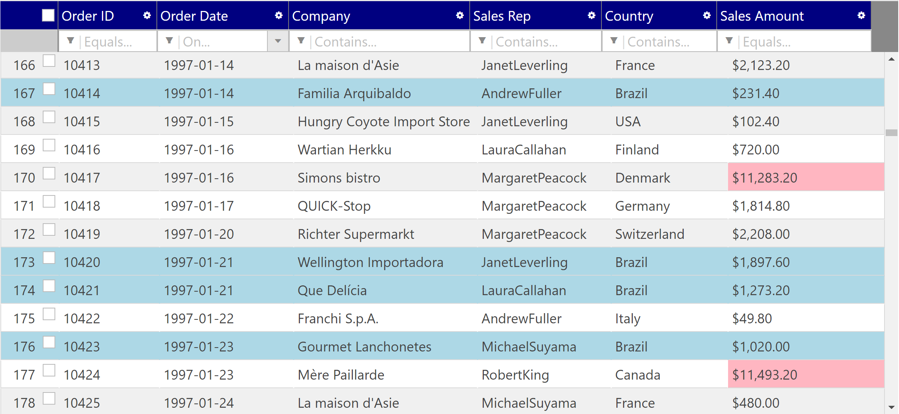

#  Section 5

In this section, you do a css work here for styling igGrid.

## Steps
1. [Override-default-theme](05-01-Override-Default-Theme.md)
2. [Conditional Styling](05-02-Conditional-Styling.md)

## What you build in this section

## Next
[05-01 Override default theme](05-01-Override-Default-Theme.md)