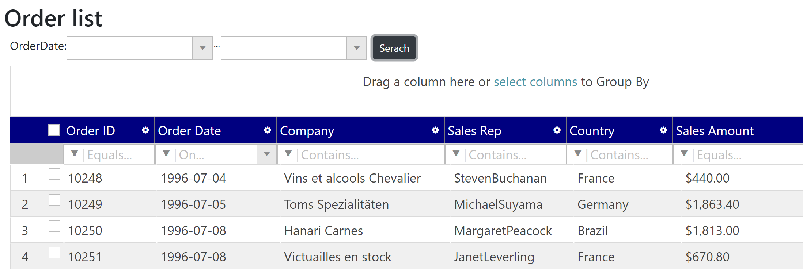
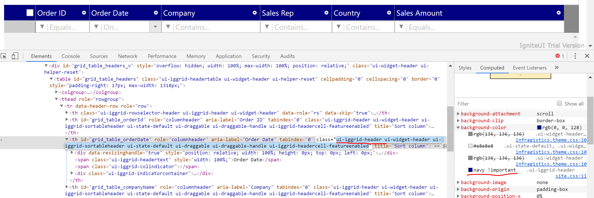

# Override default theme

Ignite UI controls have a default theme which is defined in infragistics.theme.css. You can change the styles by overriding the default theme.

## Change header color

Change the header color on igGrid.

Open wwwroot\\css\\site.css. Override ui-iggrid-header class to change the background to navy as below.

wwwroot\\css\\site.css

```css
...
/* ↓↓↓ Added ↓↓↓ */
.ui-iggrid-header {
    background-color: navy !important;
}
/* ↑↑↑ Added ↑↑↑ */
```

## Check the result

Run the app and check the result. If nothing changed, try clear the browser cache by hitting ctrl + F5.



## Note

igGrid has many styles you can change. You can learn those styles in the default theme from below link. 

[igGrid styling theme](https://jp.igniteui.com/help/api/2019.1/ui.igGrid#theming)

But the shortest path to find which class you should override to change styles is to use the inspector of browser.



## Next
[03-02 Use Pivot Controls](03-02-Use-Pivot-Controls.md)
