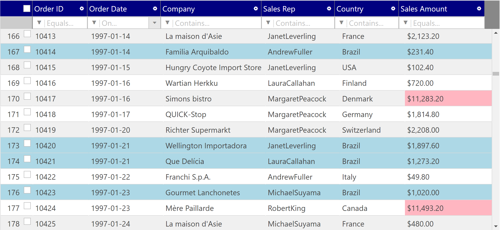

# Conditional Styling

Style rows and cells depending on the condition of cell value.

## Change background color on a specific row/cell

Change background color on a specific row/cell with the condition below.

- If Country is "Brazil", then change the row's background color to lightblue.
- If salesAmout is greater than 3,000, change the cell's background color to lightpink.

Open wwwroot\\css\\site.css. Firstly, define the classes for both the row background with lightblue and the cell background with lightpink as below.

wwwroot\\css\\site.css

```css
...
.ui-iggrid-header {
    background-color: navy !important;
}
/* ↓↓↓ Added ↓↓↓ */
.row-highlight{
    background-color: lightblue !important;
}

.cell-highlight {
    background-color: lightpink;
}
/* ↑↑↑ Added ↑↑↑ */
```

Next, You need to handle the rowsRendered event to set css classes defined above to cells and rows which match the specified conditions. The rowsRendered event is fired when the grid (re)renders rows. 


```js
...
columns: [
    ...
],
// ↓↓↓ Added ↓↓↓
rowsRendered: function (evt, ui) {
    // Setting css classes to specific rows/cells in rowsRendered
    var grid = ui.owner;  // Get the grid instance
    var rows = grid.rows();  // Get rows to be rendered
    var length = rows.length;  // Get row count
    // Loop all rendered rows
    for (var i = 0; i < length; i++) {
        var row = rows[i]; //rendering row
        var rowID = row.getAttribute("data-id");
        // If the row is grouped row or summary row, then skip the row.
        if (row.className.includes("groupedrow") || row.className.includes("summaryrow")) continue;
        // Get cell values and check if it should be styled.
        var country = grid.getCellValue(rowID, "shipCountry");
        var salesAmount = grid.getCellValue(rowID, "salesAmount");
        var salesAmountCell = grid.cellById(rowID, "salesAmount")[0];
        if (country == "Brazil") {
            // Styling row
            $(row).addClass("row-highlight");
        }
        if (salesAmount > 3000) {
            // Styling cell
            $(salesAmountCell).addClass("cell-highlight");
        }
    }
},
// ↑↑↑ Added ↑↑↑
features: [
    {
        name: "Sorting",
    },
...
```

Additinal comments for what's happening in rowsRendered event:
1. Get a grid instance and rendering rows from the second parameter "ui".
2. Loop the rows and check if the row/cell matches the condition.
3. If it matches the condition, appending css class "row-highlight"/"cell-highlight" to row/cell DOM element by using jQuery.

## Check the result

Run the app and check the result.




## Note

[igGrid Filtering options](https://jp.igniteui.com/help/api/2019.1/ui.iggridfiltering#options)

[igGrid Selection options](https://jp.igniteui.com/help/api/2019.1/ui.iggridselection#options)

[igGrid RowSelectors options](https://jp.igniteui.com/help/api/2019.1/ui.iggridrowselectors#options)

[igGrid GroupBy options](https://jp.igniteui.com/help/api/2019.1/ui.iggridgroupby#options)


## Next
[06-00 Overview of Section6](../06-Export-Excel/06-00-Overview-of-Section6.md)
