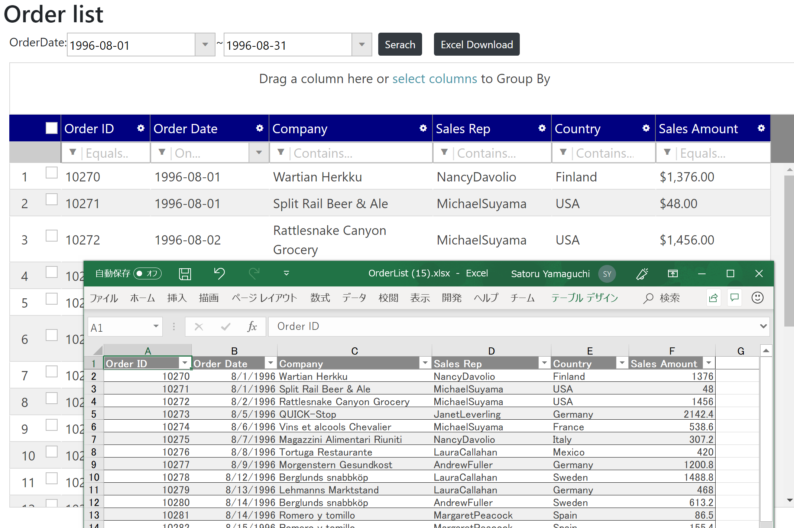

# Export as Excel

Adding a capability to allow users to export a grid as an Excel file.

## Put a button for excel exporting

Open Views\\Home\\Index.cshtml. Put a button element for exporting excel as below.

Views\\Home\\Index.cshtml

```html
...
    <div id="container" class="d-flex align-items-start mb-2">
        OrderDate:
        <input id="orderDateFrom" type="date" />
        ~
        <input id="orderDateTo" type="date" />
        <button id="btnSearch" class="btn btn-dark btn-sm mx-2">Serach</button>
        <!-- ↓↓↓ Added ↓↓↓ -->
        <button id="btnExcel" class="btn btn-dark btn-sm mx-2">Excel Download</button>
        <!-- ↑↑↑ Added ↑↑↑ -->
    </div>
...
```

## Export Excel by using GridExcelExporter

Handle the click event of "Excel Download" button with id "btnExcel", then call exportGrid() function in GridExcelExporter class to export grid as an Excel file.

Views\\Home\\Index.cshtml

```js
...
$(function () {
    $("#orderDateFrom").igDatePicker({ dateInputFormat: "yyyy-MM-dd" });
    $("#orderDateTo").igDatePicker({ dateInputFormat: "yyyy-MM-dd" });
    // ↓↓↓ Added ↓↓↓
    $('#btnExcel').click(function (e) {
        $.ig.GridExcelExporter.exportGrid(
            $("#grid"), // 1st parameter is for grid instance
            { fileName: "OrderList" }, //2dn parameter is for setting options, e.g. file name
        );
    });
    // ↑↑↑ Added ↑↑↑
    $('#btnSearch').click(function (e) {
...
```

The parameters of exportGrid() function, the first one is for the grid object, the second one is for setting options, e.g. specifying the file name.

## Check the result

Run the app and check the result.



## Note

[Online help - Infragistics Javascript Excel library](https://jp.igniteui.com/help/using-the-javascript-excel-library)

[Online sample - Excel exporting](https://www.igniteui.com/grid/export-feature-rich-grid)

## Next
[06-03 Change Excel format](06-03-Change-Excel-Format.md)
