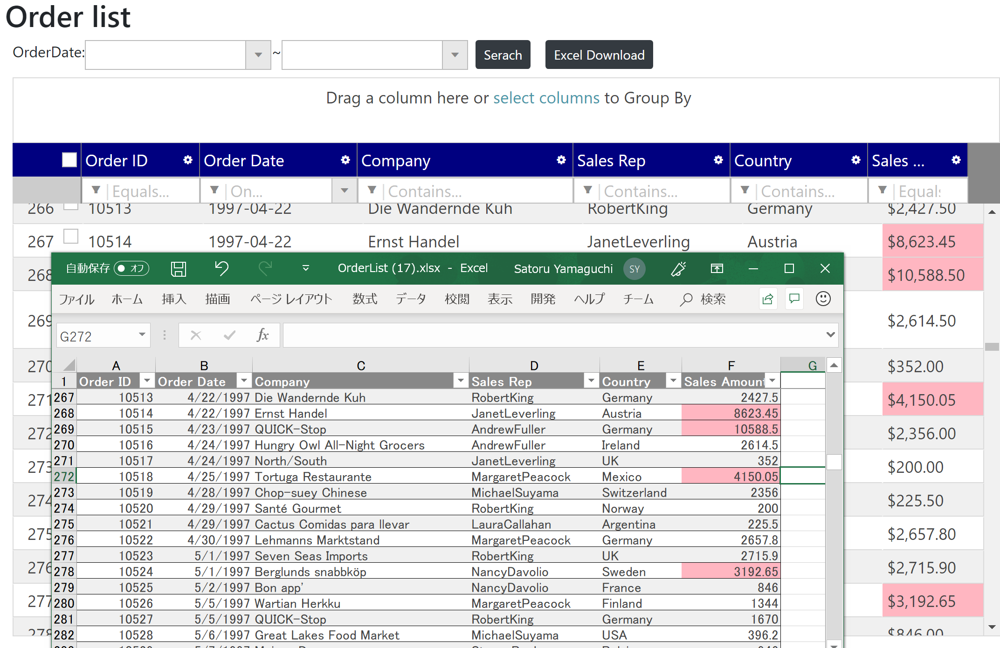

# Change Excel format

In this step, you'll change the background color of cells that match the specific condition as you did on the grid.

## Handle cellExported event to change the background of specific cells

Handle cellExported event and check if the exported cell matches the specific condition below. If it matches the condition, change the background color of the cell by using cellFormat().fill() function.

- If salesAmout is greater than 3,000, change the cell's background color to lightpink.

Note that you can handle events for exportGrid() function by specifying the 3rd parameter.

Views\\Home\\Index.cshtml

```js
...
$('#btnExcel').click(function (e) {
    $.ig.GridExcelExporter.exportGrid(
        $("#grid"), // 1st parameter is for grid instance
        { fileName: "OrderList" }, //2dn parameter is for setting options, e.g. file name
        // ↓↓↓ Added ↓↓↓
        {
            cellExported: function (sender, args) {
                // If the salesAmount is greater than 3000 then set lightpink to the background of the cell.
                if (args.columnKey == "salesAmount" && args.cellValue > 3000) {
                    var fillColor = $.ig.excel.CellFill.createSolidFill("#FFB6C1");
                    args.xlRow.cells(args.columnIndex).cellFormat().fill(fillColor);
                }
            }
        }
        // ↑↑↑ Added ↑↑↑
    );
});
...
```

## Check the result

Run the app and check the result.



## Note

[Online help - Infragistics Javascript Excel library](https://jp.igniteui.com/help/using-the-javascript-excel-library)

[Online sample - Excel exporting](https://www.igniteui.com/grid/export-feature-rich-grid)
